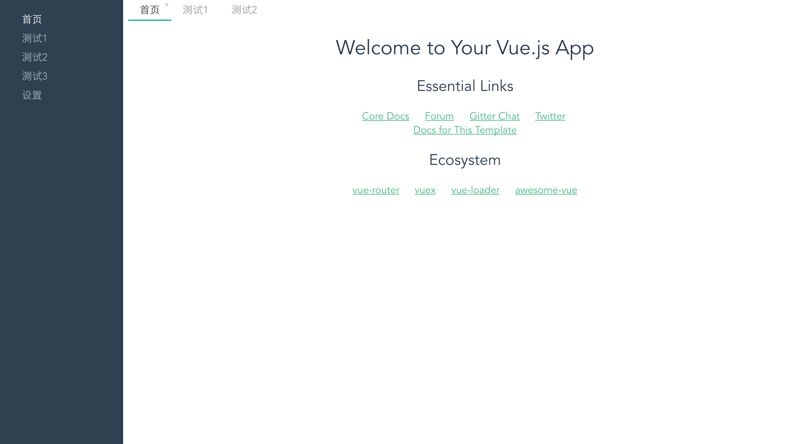

# Vue-Tabs

> A Vue.js tabs framework replacing the URL-ROUTER for Vue2.0 (多tab页轻型框架，在多tab系统中替代路由)

- [Documentation](./docs)

## Demo  

[查看 DEMO](http://alexqdjay.oschina.io/vue-tab)



## Usage

**Step1. config**

``` JavaScript
// tabs.js
// config
import Hello from './components/Hello'
export default [{
    name: 'home', // name UNIQUE
    title: '首页', // tab's title
    component: Hello
}, {
    name: 'test1',
    title: '测试1',
    component: {
        template: '<h2>测试1</h2>'
    }
}]
```

**Step2. New instance & use**

``` JavaScript
import VueTaber from 'vue-tabs'
import '../vue-tabs.css'
import tabs from './tabs.js'

const vueTaber = new VueTaber({
    tabs
})

Vue.use(VueTaber)
new Vue({
    el: '#app',
    taber: vueTaber,
    template: '<App/>',
    components: {
        App
    }
})

```

**Step3. Html Element**

``` html
<div id="app">
<vue-tabs></vue-tabs>
</div>
```

**Step4. Use api to open a tab**

``` JavaScript
this.$taber.open({
    name: item.name
})
```

## Contributing

**[Contributing](./.github/CONTRIBUTING.md)**

